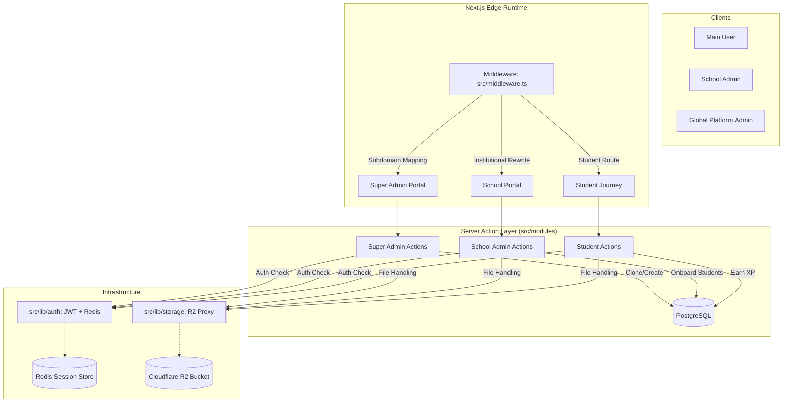

# TechNurture: Deep Audit & Security Intelligence Report

> **Learning that feels like play. Built like a fortress.**

---

## 🏗️ Project Architecture & File Hierarchy

```text
TechNurture/
├── src/                    # App Router + Modules
│   ├── app/                # UI Routes (Admin, School, Student)
│   ├── modules/            # Isolated Logic (Super-Admin, School-Admin, Student, Auth)
│   ├── db/                 # Drizzle Schema
│   ├── lib/                # Drivers (JWT Auth, Redis, Storage)
│   └── middleware.ts       # Subdomain Routing
├── database/               # SQL Dumps
├── local_storage/          # Fallback Disk Storage
└── README.md               # Technical Source of Truth
```

---

## 🛰️ System Flow & Connectivity



---

## 🛡️ Real-Code Security Review (Self-Correction)

Based on a 30-point security checklist, we have audited the current **live code**. Here are the critical gaps identified:

### 🔴 High Severity (Immediate Fix Required)
| Task | Code Reality | Risk | Fix |
| :--- | :--- | :--- | :--- |
| **Server-Side Permission Checks** | `getSchoolProfile(schoolId)` in `school-admin/actions.ts` accepts raw IDs without verifying session ownership. | **Horizontal Privilege Escalation**: Any user can view/edit any school by guessing a UUID. | Validate `session.school_id === requestedId` in every action. |
| **Established Auth Provider** | Custom implementation in `src/lib/auth.ts` (jose + redis). | **DIY Auth Risk**: Higher chance of implementation bugs compared to Clerk/Supabase. | Migrate to a managed provider (Clerk/Supabase) for production. |
| **Rate Limiting** | No evidence of rate-limiters in `middleware.ts` or API routes. | **Brute-Force & DoS**: Login and Registration routes can be hammered indefinitely. | Implement `upstash/ratelimit` in the middleware. |
| **Secret Exposure** | `src/lib/auth.ts` has a hardcoded string fallback for `JWT_SECRET`. | **Token Forgery**: If .env fails to load, the system uses a known key. | Throw an error if `process.env.JWT_SECRET` is missing. |

### 🟡 Moderate Severity (Build Phase)
| Task | Code Reality | Risk | Fix |
| :--- | :--- | :--- | :--- |
| **Row-Level Security (RLS)** | `schema.ts` defines tables but lacks RLS policies. | **Data Leakage**: Application bugs can leak data across tenants at the DB level. | Enable RLS on Postgres for `schools` and `users`. |
| **Input Sanitization** | Server actions (e.g., `registerStudent`) use `any` types for payloads. | **Mass Assignment**: Attackers can inject fields (like `role: super_admin`) into updates. | Use **Zod schemas** in all Server Actions to whitelist fields. |
| **Storage Security** | `storage.ts` lacks file signature (magic number) checking and size limits. | **Malicious Uploads**: Users can upload 1GB files or rename `.exe` to `.png`. | Add `MAX_FILE_SIZE` and use a buffer-signature validator. |
| **Audit Logging** | `auditLogs` table exists but no code writes to it. | **Non-Repudiation**: No record of who deleted a course or changed a payment status. | Add `logAuditAction()` calls to all deletion/role-change actions. |

### 🟢 Low Severity (Clean Up)
| Task | Code Reality | Risk | Fix |
| :--- | :--- | :--- | :--- |
| **Account Deletion Flow** | No `deleteAccount` logic found in student or admin modules. | **GDPR Compliance**: Users cannot exercise their right to be forgotten. | Implement a cascaded deletion or "soft-delete" archival flow. |
| **CORS Wildcards** | Wildcard/Default CORS behavior in API routes. | **Cross-Site Attacks**: Potential for unauthorized origin requests. | Explicitly define allowed production domains in `next.config.ts`. |
| **Console Logs** | `console.error` found in `payment/verify/route.ts`. | **Infoleak**: Server errors might leak internal paths or stack traces. | Use a production logger (Winston/Pino) and remove raw logs. |

---

## 🚀 Identified Tech-Debt Highlights
1.  **No Session Refresh Rotation**: Max 7-day token is set, but session hijacking protection (rotation) is absent.
2.  **No Password Reset Logic**: UI exists but backend implementation/rate-limiting is missing.
3.  **No Test/Prod Separation**: Current codebase relies on `.env` but lacks explicit configuration for separate staging webhooks.

---
*Deep Code Review & Audit report finalized on March 7, 2026.*
